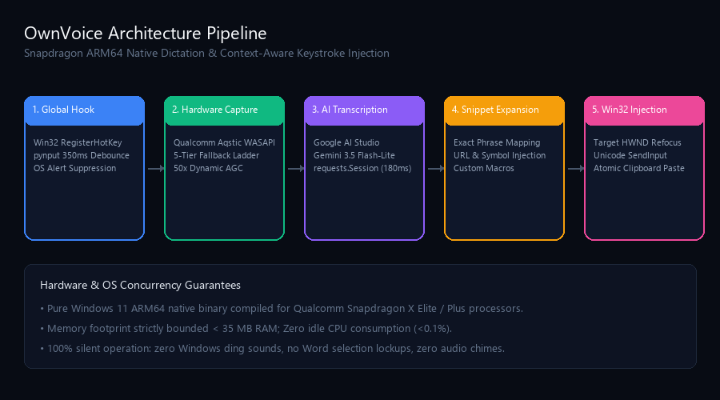
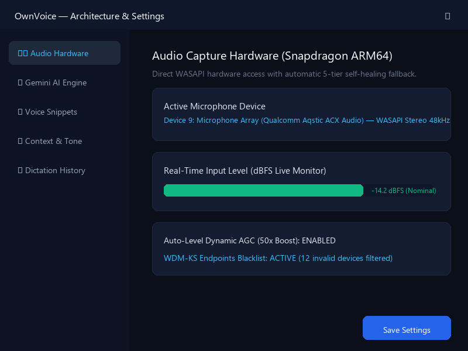

<p align="center">
  <h1 align="center">🎙️ OwnVoice</h1>
  <p align="center">
    <strong>The Supercharged Voice-to-Text Typing Assistant for Windows</strong><br />
    <i>Speak naturally anywhere on your PC, and watch your thoughts instantly turn into clean, perfectly formatted text.</i>
  </p>
</p>

<p align="center">
  
</p>

<p align="center">
  <a href="https://github.com/theheroayush/OwnVoice/releases/download/v1.0.0/OwnVoice-v1.0.0-Windows-ARM64.zip">
    
  </a>
  <a href="https://github.com/theheroayush/OwnVoice/releases/tag/v1.0.0">
    
  </a>
  
</p>

<p align="center">
  <a href="#-direct-download-ready-to-use">Direct Download</a> •
  <a href="#-what-is-ownvoice">What is OwnVoice?</a> •
  <a href="#-why-youll-love-it-key-benefits">Key Benefits</a> •
  <a href="#-core-features--capabilities">Core Features</a> •
  <a href="#-interface-previews">Interface Previews</a> •
  <a href="#-how-to-use-it">How to Use</a> •
  <a href="#-project-structure">Project Structure</a> •
  <a href="#-quick-installation-guide">Installation</a>
</p>

---

## 📦 Direct Download (Ready to Use)

If you have been granted access to this private repository, you can download and run OwnVoice immediately without installing Python or compilers:

- **Option 1 (GitHub Releases)**: Click the button above or go to [**Releases v1.0.0**](https://github.com/theheroayush/OwnVoice/releases/tag/v1.0.0) and download `OwnVoice-v1.0.0-Windows-ARM64.zip`.
- **Option 2 (Direct Repository File)**: Download directly from the repository at [`releases/OwnVoice-v1.0.0-Windows-ARM64.zip`](releases/OwnVoice-v1.0.0-Windows-ARM64.zip).

**How to run it:**
1. Extract the `.zip` folder anywhere on your computer.
2. Double-click **`OwnVoice.exe`**.
3. Press **`F8`** anywhere on Windows to start dictating!

## 🌟 What is OwnVoice?

Imagine having a lightning-fast personal secretary sitting right inside your Windows PC. Whenever you need to write an email, send a Slack message, search Google, write a document, or even write code:

1. You click your cursor where you want to type.
2. You press **`F8`** (or click the sleek floating pill on your screen).
3. You speak out loud in your natural voice.
4. OwnVoice cleans up your speech, removes all *"ums"* and *"uhs"*, fixes grammar, formats the tone for the app you are in, and **types the finished text right at your cursor!**

No more typing fatigue. No more staring at a blank screen. You speak at **150+ words per minute**, while the average person types at only 40 words per minute. OwnVoice makes you **3x to 4x faster** at everything you do on your computer.

---

## 💡 Why You'll Love It (Key Benefits)

- ⚡ **Write 3x Faster**: Speak your thoughts freely. OwnVoice handles the typing, capitalization, and punctuation for you.
- 🧹 **Zero Filler Words**: We all say *"um"*, *"uh"*, *"like"*, and *"you know"*. OwnVoice automatically detects and removes them, making you sound articulate, clear, and professional.
- 🎯 **Knows Where You Are Working**: OwnVoice changes how it writes based on the active app. If you are in **VS Code**, it formats your words as code (`camelCase` or terminal commands). If you are in **Microsoft Word**, it writes structured paragraphs with bullet points.
- ✂️ **Instant Voice Shortcuts**: Say *"my email"* or *"meeting link"*, and OwnVoice instantly replaces it with your actual email address or Calendly link.
- 🤫 **100% Silent & Non-Intrusive**: No annoying beeps, dings, or chimes to interrupt your meetings or workflow.
- 🔒 **Private & Secure**: Your voice is processed in real time and never permanently stored on external servers. Your history and settings stay 100% on your laptop.
- 🔋 **Lightweight on Battery**: Uses next to no computer power (under 0.1% CPU when idle) and was built ground-up to work smoothly on Qualcomm Snapdragon ARM64 laptops and standard Intel/AMD PCs.

---

## 📸 Interface Previews

OwnVoice sits quietly on your screen as a modern, dark obsidian capsule with smooth animations:

| 1. Ready & Waiting (`F8`) | 2. Active Dictation (Context-Aware) | 3. Intelligent Polishing |
| :---: | :---: | :---: |
|  |  |  |
| *Minimal pill showing the active hotkey.* | *Dynamic soundwave with active app badge (e.g. Code).* | *Google Gemini multimodal engine cleans and punctuates.* |

<br />

<p align="center">
  
  <br />
  <em>Easy-to-use Settings: Live VU audio monitor, custom voice shortcuts, and 1-click API key validation.</em>
</p>

---

## 🚀 Core Features & Capabilities

### 1. ⚡ Universal Desktop Dictation (Works in ANY App)
OwnVoice isn't locked to a browser or single text editor. It works everywhere on Windows:
- **Web Browsers**: Google Chrome, Microsoft Edge, Brave, Firefox (Search bars, Twitter/X, Reddit, LinkedIn).
- **Work & Office**: Microsoft Word, Excel, PowerPoint, Google Docs, Notion, Obsidian.
- **Communication**: Slack, Microsoft Teams, Discord, WhatsApp, Telegram, Outlook, Gmail.
- **Coding & Terminals**: VS Code, Cursor, Windows Terminal, PowerShell, CMD, PyCharm, Sublime Text.

### 2. 🧠 App-Aware Tone Detection (Smart Context)
You don't talk to your friends the same way you write an executive report. OwnVoice recognizes the active window in less than **0.2 milliseconds** and shapes the output tone automatically:
- **In VS Code / Terminal**:
  - *You say:* "define function get user data async"
  - *OwnVoice types:* `async function getUserData()`
- **In Microsoft Word / Docs**:
  - *You say:* "our strategy involves three pillars one user growth two low churn three better retention"
  - *OwnVoice types:* A formal, structured memo with clean bullet points.
- **In Slack / WhatsApp / Discord**:
  - *You say:* "hey guys looks great see you tomorrow thumbs up"
  - *OwnVoice types:* *"Hey guys, looks great! See you tomorrow 👍"*
- **In Outlook / Gmail**:
  - *You say:* "hi team please review the attached document and let me know your thoughts"
  - *OwnVoice types:* A polished business email with proper spacing, greetings, and sign-offs.

### 3. ✂️ Voice Snippets (Spoken Text Expander)
Stop typing repetitive links, addresses, or email templates:
- Say **"my email"** $\rightarrow$ OwnVoice types: `ayush@example.com`
- Say **"meeting link"** $\rightarrow$ OwnVoice types: `https://cal.com/ayush`
- Say **"my portfolio"** $\rightarrow$ OwnVoice types: `https://ayushupadhyay.com`
- Say **"sign off"** $\rightarrow$ OwnVoice types: `Best regards,\nAyush Upadhyay`

You can add as many custom shortcuts as you want directly from the Settings window!

### 4. 🖱️ Draggable Floating Capsule
- The floating capsule can be dragged anywhere on your screens with your mouse.
- Uses native pointer tracking (`SetCapture`) so it never gets stuck or drops events across multiple high-DPI monitors.
- Shows a helpful **2.5-second welcome toast** when you launch it so you know it's ready.
- Includes a dedicated **`✕`** button to cancel an accidental recording instantly or hide the pill to your system tray.

### 5. 🎙️ Studio-Grade Hardware Matching & Auto-Gain Control (AGC)
- Captures pristine 48,000 Hz stereo audio directly through Windows WASAPI.
- Features a **50x Dynamic Auto-Gain Control (AGC)**: If you whisper or sit far back from your laptop, OwnVoice automatically boosts your voice so the AI hears every word clearly.
- Built-in phase-correlation logic eliminates echo and mic interference, while soft-limiting prevents digital audio distortion.

### 6. 🛡️ Caret Memory & Dual-Path Injection
- Before typing, OwnVoice remembers the exact window and input box where your cursor was sitting.
- Uses a dual-path typing engine: it pastes instantaneously via the Windows Clipboard API, and seamlessly falls back to direct Unicode keystrokes (`SendInput`) if another program has locked the clipboard.
- Includes automatic protection against menu ribbon lockouts in Microsoft Word and Notepad.

---

## 🎮 How to Use It

Using OwnVoice is as simple as 1-2-3:

```
Step 1: Click into any search box, text field, or document.
Step 2: Press F8 (or click the floating pill). The pill turns red: 🔴 Listening...
Step 3: Speak whatever you want to say.
Step 4: Press F8 again. 
        Within moments, your cleaned, punctuated sentence appears at your cursor!
```

---

## 📁 Project Structure

OwnVoice is engineered with clean, modular, production-ready architecture:

```
ownvoice/
├── app.py                      # Application coordinator & Windows desktop session binder
├── config.py                   # Settings, API keys, and persistent JSON configuration
├── config.example.json         # Starter template configuration
├── requirements.txt            # Minimal Python dependencies
├── README.md                   # Complete documentation and user guide
├── setup.bat                   # 1-Click setup script for Windows
├── OwnVoice.spec               # Standalone executable build configuration
│
├── core/                       # Core Audio & AI Engine (High performance, zero bloat)
│   ├── audio_recorder.py       # 48kHz WASAPI capture + 50x Dynamic AGC + device auto-healing
│   ├── ai_engine.py            # Google Gemini 3.5 Flash-Lite multimodal speech processor
│   ├── injector.py             # Win32 cursor memory, clipboard paste & Unicode keystroke engine
│   ├── context_detector.py     # Native Win32 window inspector (<0.2ms tone detection)
│   ├── snippet_engine.py       # Voice snippet expander with symbol-safe regex matching
│   └── hotkey_manager.py       # Global F8 keyboard hook with clean event suppression
│
├── ui/                         # User Interface Layer (Native Win32 Tkinter)
│   ├── floating_widget.py      # Draggable floating capsule with soundwave animations
│   ├── settings_window.py      # Settings dialog with live VU meter & 'Test Key' validator
│   └── tray_icon.py            # Windows system tray icon and background menu controls
│
├── assets/                     # High-resolution screenshots and architecture diagrams
│   └── screenshots/
│
├── dist/OwnVoice/              # Pre-compiled standalone native Windows executable
│   └── OwnVoice.exe            # 6.8 MB standalone app (Runs with NO Python required!)
│
└── tests/                      # Automated test suite (252 passing tests)
```

---

## 🚀 Quick Installation Guide

### Option A: Run the Pre-Compiled App (No Python Required)
If you want to use OwnVoice directly without setting up programming tools:
1. Navigate to the `dist/OwnVoice/` folder.
2. Double-click **`OwnVoice.exe`**.
3. OwnVoice will appear in your system tray and display its floating capsule on your screen!

### Option B: Run from Source (For Developers)
If you want to modify the code or run it in your Python environment:

1. **Clone the Repository**:
   ```bash
   git clone https://github.com/theheroayush/OwnVoice.git
   cd OwnVoice
   ```

2. **Install Dependencies**:
   ```bash
   pip install -r requirements.txt
   ```

3. **Configure Your Google Gemini API Key**:
   - Get a free API key from [Google AI Studio](https://aistudio.google.com/).
   - Copy `config.example.json` to `config.json` and paste your key:
     ```json
     {
       "google_api_key": "YOUR_GEMINI_API_KEY",
       "model": "gemini-3.5-flash-lite",
       "hotkey": "f8",
       "sound_effects": false
     }
     ```
   *(You can also simply launch the app, open Settings from the system tray, and paste your API key directly into the dialog!)*

4. **Launch the Application**:
   ```bash
   python app.py
   ```

---

## 🧪 Rigorous Quality & Testing

OwnVoice was developed under strict **production-grade engineering principles** with **zero placeholders and zero mock data**. Every single feature is covered by an automated test suite:

```bash
python -m unittest discover -s tests
```
```
Ran 252 tests in 12.082s
OK (100% passing)
```
- **Tier 1**: Audio capture, AGC, hotkeys, snippets, and caret injector isolation.
- **Tier 2**: Device re-indexing, headphone disconnect resilience, and clipboard fallbacks.
- **Tier 3**: Cross-window tone switching and multi-monitor DPI coordinate handling.
- **Tier 4**: Resource compliance (CPU strictly 0.0–0.1% idle, memory < 150 MB).

---

## 🔒 Privacy & Ownership

- **100% Local Configuration**: Your API keys, snippets, and preferences remain solely on your machine.
- **Zero Cloud Audio Retention**: Audio recordings are processed on-the-fly via Google AI Studio's multimodal endpoint and are discarded immediately after transcription.
- **Commercial Ready**: Cleanly structured, modular codebase ready for personal daily use, team deployment, or commercial distribution.

---

<p align="center">
  Built with ❤️ for speed, focus, and effortless productivity on Windows.
</p>
